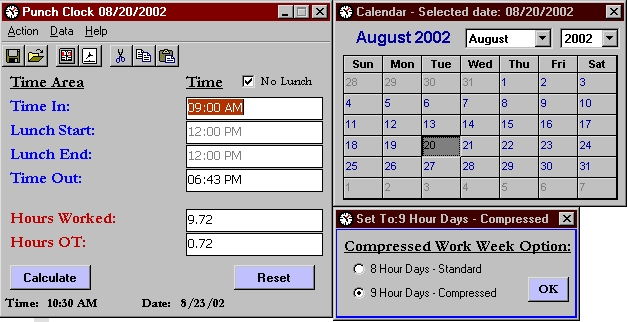



## Punch Clock Version 1\.3\.1

### Description

This is a new submission of a project I am working on for my office. It allows for Hour Tracking. Ini file not included (self generates)

Fixed an error.
 
### More Info
 

             |
---                |---
**Submitted On**   |2002-08-23 10:55:14
**By**             |[BlaiseMan](https://github.com/Planet-Source-Code/PSCIndex/blob/master/ByAuthor/blaiseman.md)
**Level**          |Intermediate
**User Rating**    |4.0 (8 globes from 2 users)
**Compatibility**  |VB 6\.0
**Category**       |[Complete Applications](https://github.com/Planet-Source-Code/PSCIndex/blob/master/ByCategory/complete-applications__1-27.md)
**World**          |[Visual Basic](https://github.com/Planet-Source-Code/PSCIndex/blob/master/ByWorld/visual-basic.md)
**Archive File**   |[Punch\_Cloc1216498232002\.zip](https://github.com/Planet-Source-Code/blaiseman-punch-clock-version-1-3-1__1-38216/archive/master.zip)

